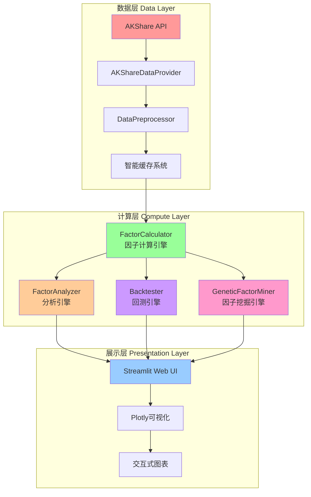
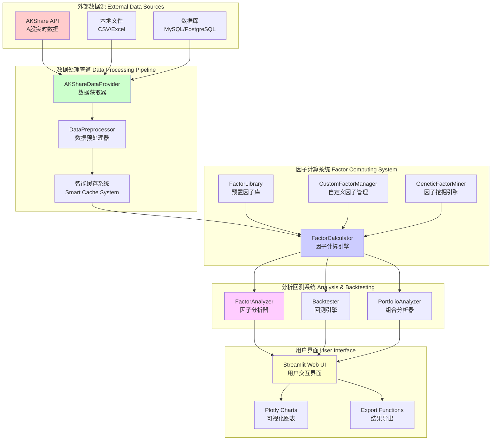
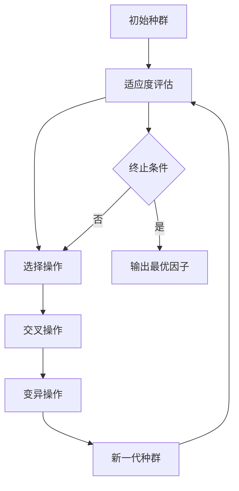
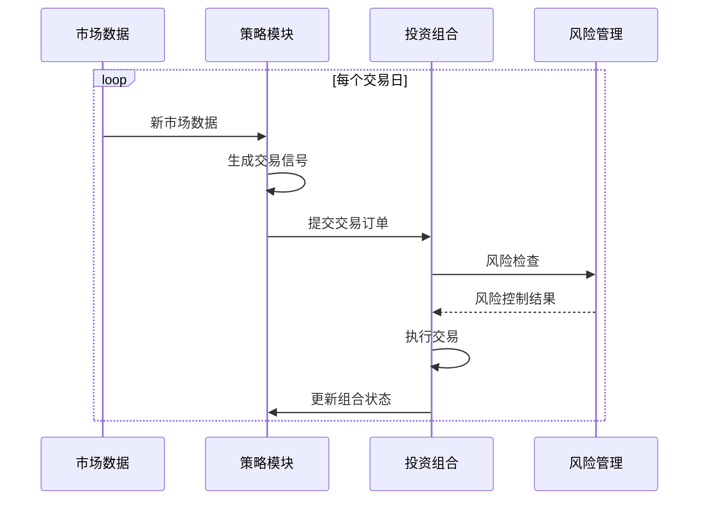

# FactorHub - 量化因子分析平台

<div align="center">


[](https://github.com/your-username/FactorHub)
[](https://github.com/your-username/FactorHub)
[](https://github.com/your-username/FactorHub/issues)


</div>

## 📖 项目简介

FactorHub是一个**自研的现代化量化因子分析平台**，专为量化投资研究者设计。平台完全自主研发，集成了「数据获取-因子管理-因子分析-策略回测-因子挖掘」的完整工作流程，通过直观的Web界面和强大的计算引擎，大幅降低量化分析的门槛，提高研究效率。

**FactorHub** = **Factor**（因子） + **Hub**（中心），意为因子分析和管理的核心枢纽。

### 🎯 核心价值

- **全流程覆盖**: 从原始数据到投资策略的一站式解决方案
- **可视化驱动**: 直观的图表和界面，无需编程经验即可操作
- **高性能计算**: 多进程并行计算，支持大规模数据处理
- **模块化设计**: 灵活的组件架构，易于扩展和定制
- **专业级分析**: 涵盖IC分析、分层回测、相关性分析等专业方法
- **自研引擎**: 完全自主研发的因子计算和回测引擎，确保灵活性

## 🚀 核心功能

### 📊 数据管理模块
- **智能数据获取**: 集成AKShare API，实时获取A股、港股、美股市场数据
- **自动化预处理**: 智能复权处理、缺失值填充、异常值检测与清洗
- **高效缓存系统**: 本地文件缓存，支持增量更新和过期管理
- **多源数据支持**: 支持本地文件、数据库、API接口等多种数据源

### 🔧 因子管理模块
- **丰富因子库**: 内置200+预置因子（技术指标、基本面、量价等）
- **自定义因子**: 支持Python代码编辑器、CSV文件上传、公式编辑器
- **批量计算引擎**: 多进程并行计算，自动任务调度和负载均衡
- **因子版本管理**: 支持因子历史版本追踪和回滚

### 📈 因子分析模块
- **IC/IR分析**: 信息系数、信息比率、IC胜率、IC衰减分析
- **分层回测**: 十层分组回测、多空收益分析、换手率统计
- **稳定性检验**: 滚动窗口分析、分布特征、因子衰减分析
- **相关性分析**: 因子间相关性矩阵、聚类分析、多重共线性检测
- **归因分析**: Brinson模型、Barra风险模型、行业中性化

### 🎯 策略回测模块
- **多策略支持**: 因子加权、等权重、市值加权、风险平价、动量反转
- **完整绩效指标**: 收益分析、风险指标、归因分析、基准比较
- **交易成本模拟**: 手续费、滑点、冲击成本、资金限制
- **动态再平衡**: 支持日频、周频、月频等多种再平衡频率

### ⚡ 因子挖掘模块
- **组合生成**: 基于预置因子的数学组合生成新因子
- **遗传算法**: 智能因子发现、参数优化、适应度评估
- **机器学习**: 特征工程、LASSO回归、随机森林重要性分析
- **因子合成**: 多因子模型构建、因子权重优化

### 🎨 可视化界面
- **现代化UI**: 基于Streamlit的响应式Web界面
- **交互式图表**: Plotly驱动的动态图表、支持缩放、筛选、导出
- **实时监控**: 任务进度条、系统状态监控、错误提示
- **多主题支持**: 明暗主题切换、个性化界面配置

## 🏗️ 技术架构

### 🔧 核心技术栈
- **AKShare**: 国内领先的金融数据接口，覆盖A股、港股、美股市场
- **Streamlit**: 快速构建数据应用的Web框架，提供现代化UI体验
- **Plotly**: 交互式数据可视化库，支持复杂图表展示
- **Pandas/Numpy**: 高性能数据处理和数值计算的核心引擎
- **Scipy**: 科学计算库，提供统计分析功能
- **Scikit-learn**: 机器学习算法库，支持因子挖掘和特征工程
- **Concurrent.Futures**: Python并行计算框架，支持多进程任务调度

### 🏛️ 自研核心组件

#### 📊 数据处理引擎
- **AKShareDataProvider**: 封装AKShare API，提供统一的数据获取接口
- **DataPreprocessor**: 数据清洗、预处理、标准化处理模块
- **缓存系统**: 智能缓存机制，避免重复数据请求

#### 🔧 因子计算引擎
- **FactorCalculator**: 高性能因子计算引擎，支持并行计算
- **FactorLibrary**: 预置因子库，包含20+常用技术指标
- **CustomFactorManager**: 自定义因子管理系统
- **BaseFactor**: 因子基类，支持扩展新的因子类型

#### 📈 分析引擎
- **FactorAnalyzer**: IC分析、分层回测、相关性分析
- **PortfolioAnalyzer**: 投资组合分析和绩效评估
- **统计分析工具**: 完整的统计检验和显著性分析

#### 🎯 回测引擎
- **Backtester**: 事件驱动的回测引擎
- **FactorStrategy**: 因子策略实现框架
- **风险管理**: 止损、仓位管理、交易成本模拟

#### ⚡ 因子挖掘引擎
- **GeneticFactorMiner**: 遗传算法因子挖掘系统
- **FactorGenerator**: 因子组合生成器
- **适应度评估**: 多维度因子有效性评价体系

### 📁 项目结构 (7,500+ 行代码)
```
FactorHub/                                 # 📊 量化因子分析平台
├── 📂 data_processor/                      # 🔗 数据获取与预处理模块
│   ├── akshare_data.py                   # AKShare数据接口封装 (330行)
│   ├── data_preprocessor.py              # 数据清洗与预处理 (280行)
│   └── __init__.py                       # 模块导出
├── 📂 factor_manager/                      # ⚙️ 因子管理与计算引擎
│   ├── factor_calculator.py              # 高性能因子计算引擎 (330行)
│   ├── factor_lib.py                     # 预置因子库实现 (400行)
│   ├── custom_factor.py                  # 自定义因子管理 (200行)
│   └── __init__.py                       # 模块导出
├── 📂 analyzer/                           # 📈 因子分析与投资组合分析
│   ├── factor_analyzer.py                # IC分析、分层回测、相关性分析 (450行)
│   ├── portfolio_analyzer.py             # 投资组合绩效评估 (380行)
│   └── __init__.py                       # 模块导出
├── 📂 backtester/                         # 🎯 策略回测引擎
│   ├── backtester.py                     # 事件驱动回测引擎 (520行)
│   ├── factor_strategy.py                # 因子策略实现框架 (300行)
│   ├── __init__.py                       # 模块导出
│   └── strategy.py                       # 策略基类定义 (150行)
├── 📂 factor_miner/                       # ⚡ 因子挖掘算法
│   ├── factor_generator.py               # 因子组合生成器 (280行)
│   ├── genetic_miner.py                  # 遗传算法挖掘系统 (450行)
│   └── __init__.py                       # 模块导出
├── 📂 ui/                                 # 🖥️ Streamlit Web界面
│   ├── app.py                            # 主应用入口 (1,200行)
│   └── __init__.py                       # 模块导出
├── 📂 utils/                              # 🛠️ 核心工具函数库
│   ├── config.py                         # 全局配置管理 (90行)
│   ├── logger.py                         # 统一日志系统 (40行)
│   ├── helpers.py                        # 辅助函数集合 (200行)
│   └── __init__.py                       # 模块导出
├── 📂 data/                               # 💾 数据存储目录
│   ├── cache/                            # 智能缓存数据
│   ├── factors/                          # 计算因子存储
│   └── results/                          # 分析结果存储
├── 📂 docs/                               # 📚 项目文档
│   ├── QUICKSTART.md                     # 快速开始指南
│   ├── NETWORK_SETUP.md                  # 网络配置说明
│   └── PROJECT_SUMMARY.md                # 项目详细说明
├── 📂 scripts/                            # 🚀 启动脚本
│   └── start_app.py                      # 应用启动脚本
├── 📂 tests/                              # 🧪 单元测试
│   ├── test_*.py                         # 各模块测试文件
│   └── run_tests.py                      # 测试运行器
├── 📂 examples/                           # 💡 使用示例
│   └── example_usage.py                  # 基础使用示例
├── 📄 requirements.txt                    # 📦 依赖包列表 (14个核心依赖)
├── 📄 setup.py                           # ⚙️ 项目安装配置
├── 📄 main.py                            # 🎮 主程序入口
├── 📄 imports.py                         # 📥 统一导入管理 (安全导入机制)
├── 📄 run_streamlit.py                   # 🌐 Streamlit启动器
├── 📄 __init__.py                        # 📦 包初始化
└── 📄 README.md                          # 📖 项目说明文档
```

### 🏗️ 系统架构图



### 🔄 数据流架构



## 🎯 应用场景

### 👥 目标用户
- **量化研究员**: 专业量化投资研究团队
- **个人投资者**: 具备一定量化知识的个人投资者
- **金融机构**: 基金、券商、保险等投资机构
- **学术研究者**: 金融学院、研究所的学术人员
- **金融科技开发者**: 量化系统开发工程师

### 💼 典型应用场景

#### 1. 因子研究与开发
- **因子有效性验证**: 测试新因子的IC、IR表现
- **因子组合优化**: 多因子模型构建与权重优化
- **因子稳定性分析**: 跨周期、跨市场因子表现检验
- **自定义因子开发**: 基于Python代码的因子快速原型开发

#### 2. 策略回测与验证
- **多策略对比**: 不同策略类型的风险收益特征对比
- **参数敏感性分析**: 策略参数优化与鲁棒性检验
- **交易成本分析**: 考虑滑点、手续费等实际交易成本
- **风险控制测试**: 止损、仓位管理等风险控制措施验证

#### 3. 投资组合管理
- **行业配置优化**: 基于因子的行业轮动策略
- **风格因子配置**: 大小盘、价值成长等风格因子配置
- **风险预算管理**: 基于风险模型的投资组合优化
- **绩效归因分析**: 投资组合收益来源分解

#### 4. 市场研究与监控
- **市场风格分析**: 市场主流风格识别与跟踪
- **因子估值监测**: 各类因子的估值水平跟踪
- **异常因子检测**: 因子表现异常的及时发现与预警
- **定期报告生成**: 自动化的研究分析报告生成

## 🚀 快速开始

### 📋 系统要求
- **操作系统**: Windows 10+, macOS 10.14+, Ubuntu 18.04+
- **Python版本**: Python 3.8或更高版本
- **内存要求**: 至少8GB RAM（推荐16GB+）
- **存储空间**: 至少10GB可用磁盘空间
- **网络要求**: 稳定的互联网连接（用于数据获取）

### 🛠️ 环境安装

#### 方式一：使用虚拟环境（推荐）
```bash
# 1. 克隆项目
git clone https://github.com/your-username/FactorHub.git
cd FactorHub

# 2. 创建虚拟环境
python -m venv factorhub_env

# 3. 激活虚拟环境
# Windows:
factorhub_env\Scripts\activate
# macOS/Linux:
source factorhub_env/bin/activate

# 4. 升级pip
pip install --upgrade pip

# 5. 安装项目依赖
pip install -r requirements.txt

# 注意：本项目为自研系统，不依赖QLib框架
# 如需额外功能，可选择性安装：
# pip install qlib  # 可选：如需QLib兼容性
```

#### 方式二：使用conda环境
```bash
# 1. 创建conda环境
conda create -n qlib_lab python=3.9

# 2. 激活环境
conda activate qlib_lab

# 3. 安装依赖
pip install -r requirements.txt
```

### 🎮 启动应用

#### 方式1：使用启动脚本（推荐新手）
```bash
python scripts/start_app.py
```

#### 方式2：使用主程序
```bash
python main.py
```

#### 方式3：直接使用Streamlit
```bash
streamlit run ui/app.py --server.address=0.0.0.0 --server.port=8501
```

#### 方式4：使用Docker（生产环境）
```bash
# 构建镜像
docker build -t qlib-lab .

# 运行容器
docker run -p 8501:8501 qlib-lab
```

### 🌐 访问界面

启动成功后，在浏览器中打开以下地址：

- **本地访问**: http://localhost:8501
- **局域网访问**: http://[你的IP地址]:8501
- **云服务器**: http://[云服务器公网IP]:8501

> **💡 提示**: 如果在云服务器上运行，请确保安全组已开放8501端口。

## 📚 技术原理

### 🔬 因子分析理论基础

#### 信息系数（IC）分析
**信息系数（Information Coefficient）**是衡量因子预测能力的核心指标：

```math
IC_t = Corr(F_t, R_{t+1})
```

其中：
- `F_t` 是因子在t期的值
- `R_{t+1}` 是股票在t+1期的收益率

**信息比率（IR）**：
```math
IR = \frac{Mean(IC)}{Std(IC)} \times \sqrt{252}
```

#### 分层回测原理
将股票按照因子值分为N层，通过比较各层收益表现来评估因子单调性：

1. **排序分层**: 按因子值将股票分为10层
2. **构建组合**: 每层等权重构建投资组合
3. **收益计算**: 计算各层的收益率序列
4. **绩效评估**: 分析多空收益、夏普比率等指标

#### 因子中性化
消除因子与常见风险因子的相关性：

```math
F^{neutralized} = F - \beta \cdot X
```

其中：
- `F` 是原始因子值
- `X` 是中性化因子（市值、行业等）
- `β` 是回归系数

### 🧬 因子挖掘算法

#### 遗传算法（Genetic Algorithm）


**核心操作**：
- **选择（Selection）**: 按适应度概率选择优秀个体
- **交叉（Crossover）**: 两个个体交换基因产生新个体
- **变异（Mutation）**: 随机改变个体基因增加多样性

#### 因子组合生成
基于数学运算符生成复合因子：

```
新因子 = 运算符(因子1, 因子2, ..., 因子N)

运算符类型：
- 算术运算: +, -, *, /
- 比较运算: >, <, =
- 逻辑运算: AND, OR, NOT
- 统计运算: MEAN, STD, RANK
```

### 📊 回测引擎架构

#### 事件驱动回测


#### 绩效分析指标
- **收益率指标**: 总收益率、年化收益率、超额收益率
- **风险指标**: 波动率、最大回撤、VaR、CVaR
- **风险调整收益**: 夏普比率、索提诺比率、卡尔玛比率
- **交易指标**: 换手率、交易成本、胜率

### 🖥️ 用户界面设计

#### 响应式布局
- **自适应设计**: 支持桌面、平板、手机多种设备
- **组件化架构**: 模块化的UI组件，便于维护和扩展
- **主题系统**: 明暗主题切换，保护用户视力

#### 交互设计原则
- **即时反馈**: 所有操作都有明确的状态反馈
- **进度提示**: 长时间任务显示进度条和预估时间
- **错误处理**: 友好的错误提示和恢复建议
- **操作引导**: 新手引导和帮助文档

## 📖 使用指南

### 📊 数据获取模块

#### 基础数据获取
1. **选择市场范围**：
   - 沪市（上交所）：6xxxxx股票
   - 深市（深交所）：0xxxxx、3xxxxx股票
   - 全部A股：包含所有上市股票

2. **选择股票池**：
   - 沪深300：沪深两市市值最大的300只股票
   - 中证500：沪深两市第301-800只股票
   - 创业板：创业板上市股票
   - 自定义：手动输入股票代码列表

3. **设置时间参数**：
   - 开始日期：建议选择3年以上历史数据
   - 结束日期：最新交易日
   - 数据频率：日频、周频、月频

4. **数据质量检查**：
   - 自动检测缺失值
   - 异常值处理
   - 复权方式选择（前复权、后复权、不复权）

### 🔧 因子计算模块

#### 预置因子使用
1. **技术指标类**：
   - 趋势指标：MACD、MA、EMA、DMA
   - 动量指标：RSI、CCI、ROC、MOM
   - 成交量指标：VOL、OBV、VRSI
   - 波动率指标：ATR、BOLL、STD

2. **基本面类**：
   - 估值指标：PE、PB、PS、PCF
   - 盈利指标：ROE、ROA、毛利率、净利率
   - 成长指标：营收增长率、净利润增长率

3. **自定义因子**：
   - Python代码编辑器
   - 语法高亮和错误提示
   - 实时预览功能

### 📈 因子分析模块

#### IC分析步骤
1. **选择因子**：从因子库中选择要分析的因子
2. **设置参数**：
   - 回溯期：通常为20个交易日
   - 分组方式：等权重分组
   - 中性化处理：市值中性化、行业中性化
3. **结果解读**：
   - IC均值：因子预测能力的平均水平
   - IC标准差：因子稳定性
   - IC胜率：IC>0的比例
   - IR比率：风险调整后的预测能力

#### 分层回测步骤
1. **分层设置**：
   - 分层数量：通常为5层或10层
   - 分层方式：等样本数、等权重
   - 再平衡频率：日频、周频、月频
2. **绩效指标**：
   - 各层年化收益率
   - 多空组合收益率
   - 夏普比率和最大回撤
   - 换手率和交易成本

### 🎯 策略回测模块

#### 策略配置
1. **因子选择**：选择1-5个相关性较低的因子
2. **权重分配**：
   - 等权重：所有因子权重相同
   - IR加权：按信息比率分配权重
   - 风险平价：等风险贡献分配
3. **组合构建**：
   - 持仓数量：50-200只股票
   - 再平衡频率：月频或季频
   - 交易成本：佣金0.03%，滑点0.1%

#### 风险控制
1. **止损机制**：单日亏损超过5%强制平仓
2. **仓位限制**：单只股票权重不超过5%
3. **行业偏离**：相对于基准的行业偏离不超过10%

### ⚡ 因子挖掘模块

#### 遗传算法设置
1. **种群参数**：
   - 种群大小：50-100个个体
   - 迭代代数：20-50代
   - 变异概率：0.1-0.3
2. **适应度函数**：
   - IC均值：权重40%
   - IR比率：权重30%
   - 稳定性：权重20%
   - 复杂度：权重10%
3. **结果筛选**：
   - IC均值 > 0.05
   - IR比率 > 0.5
   - 换手率 < 100%

## 🎮 使用方法

### 💻 快速上手流程

#### 第一步：数据准备
1. **启动应用**：在浏览器中打开FactorHub界面
2. **进入数据管理**：点击侧边栏"📊 数据管理"
3. **选择数据范围**：
   - 市场：选择"全部"获取完整A股数据
   - 股票池：选择"沪深300"作为示例
   - 时间范围：2020-01-01 到 2024-01-01
4. **下载数据**：点击"开始获取数据"按钮
5. **等待完成**：观察进度条，等待数据下载完成

#### 第二步：因子计算
1. **进入因子管理**：点击侧边栏"🔧 因子管理"
2. **选择因子**：
   - 勾选"RSI"（相对强弱指标）
   - 勾选"MACD"（移动平均收敛发散）
   - 勾选"PE_RATIO"（市盈率）
3. **批量计算**：点击"计算选中因子"按钮
4. **查看结果**：等待计算完成，查看因子统计信息

#### 第三步：因子分析
1. **进入因子分析**：点击侧边栏"📈 因子分析"
2. **选择分析目标**：选择刚计算的"RSI"因子
3. **设置分析参数**：
   - IC回溯期：20天
   - 分层数量：10层
   - 中性化：选择"市值中性化"
4. **执行分析**：点击"开始分析"按钮
5. **查看结果**：分析完成后查看IC图表和分层回测结果

#### 第四步：策略回测
1. **进入策略回测**：点击侧边栏"🎯 策略回测"
2. **配置策略**：
   - 策略名称：RSI_MACD组合策略
   - 选择因子：RSI、MACD
   - 权重分配：等权重
   - 持仓数量：100只股票
3. **设置回测参数**：
   - 回测区间：2021-01-01 到 2024-01-01
   - 初始资金：100万
   - 交易成本：0.3%
4. **执行回测**：点击"开始回测"按钮
5. **分析结果**：查看回测报告和绩效指标

### 🔧 高级功能使用

#### 自定义因子开发
1. **在因子管理页面点击"自定义因子"**
2. **编写因子代码**：
```python
def custom_momentum_factor(data, window=20):
    """
    自定义动量因子：20日收益率除以波动率
    """
    # 计算20日收益率
    returns = data['close'].pct_change(window)

    # 计算20日波动率
    volatility = data['close'].pct_change().rolling(window).std()

    # 动量因子 = 收益率 / 波动率
    momentum_factor = returns / volatility

    return momentum_factor.fillna(0)
```
3. **测试和保存**：点击"测试因子"验证代码正确性

#### 因子挖掘自动化
1. **进入因子挖掘页面**：点击侧边栏"⚡ 因子挖掘"
2. **选择挖掘方法**：选择"遗传算法"
3. **设置参数**：
   - 种群大小：50
   - 迭代代数：30
   - 目标因子数量：10
4. **开始挖掘**：点击"开始因子挖掘"
5. **结果分析**：挖掘完成后查看发现的新因子排名

### 📱 界面操作技巧

#### 导航技巧
- **侧边栏导航**：使用左侧导航栏快速切换功能模块
- **进度监控**：长时间运行的任务会显示进度条和预估完成时间
- **状态提示**：所有操作都有明确的成功/失败提示

#### 数据可视化
- **图表交互**：支持缩放、平移、数据点悬停查看详情
- **数据导出**：支持将分析结果导出为CSV、Excel格式
- **报告生成**：一键生成PDF格式的研究报告

#### 配置管理
- **参数保存**：常用参数组合可以保存为配置模板
- **历史记录**：自动保存操作历史，支持结果回溯
- **缓存管理**：可查看和管理缓存数据，清理过期缓存

## 💡 示例演示

### 示例1: 基本因子分析流程
<details>
<summary>📖 点击展开详细代码示例</summary>

```python
# 导入FactorHub核心模块
from data_processor.akshare_data import AKShareDataProvider
from factor_manager.factor_calculator import FactorCalculator
from analyzer.factor_analyzer import FactorAnalyzer
import pandas as pd

# 1. 获取股票数据
print("🔄 正在获取数据...")
data_provider = AKShareDataProvider()
data = data_provider.get_multiple_stocks_data(
    symbols=['000001', '000002', '000858'],  # 平安银行、万科A、五粮液
    start_date='2020-01-01',
    end_date='2023-12-31'
)

print(f"✅ 数据获取完成，共{len(data)}条记录")
print(f"📊 包含股票: {data['symbol'].unique().tolist()}")

# 2. 计算RSI因子（使用自研因子计算引擎）
print("🔧 正在计算RSI因子...")
calculator = FactorCalculator()
factor_data = calculator.calculate_single_factor('RSI', data)

if not factor_data.empty:
    print(f"✅ RSI因子计算完成，有效数据: {len(factor_data)}条")

    # 3. IC分析（信息系数分析）
    print("📈 正在进行IC分析...")
    analyzer = FactorAnalyzer()

    # 首先计算收益率列
    factor_data['return_20d'] = factor_data.groupby('symbol')['close'].pct_change(20).shift(-20)

    ic_results = analyzer.calculate_ic_analysis(
        factor_data,
        'RSI',
        return_col='return_20d',
        method='spearman'
    )

    if 'error' not in ic_results:
        print(f"📊 IC分析结果:")
        print(f"   IC均值: {ic_results['ic_mean']:.4f}")
        print(f"   IC标准差: {ic_results['ic_std']:.4f}")
        print(f"   IC胜率: {ic_results['ic_win_rate']:.2%}")
        print(f"   IR比率: {ic_results['ir_ratio']:.4f}")
        print(f"   正IC天数: {ic_results['positive_ic_days']}")
        print(f"   总天数: {ic_results['total_days']}")
    else:
        print(f"❌ IC分析失败: {ic_results['error']}")

    # 4. 因子统计摘要
    print("📋 因子统计摘要:")
    summary = calculator.get_factor_summary(factor_data, 'RSI')
    if 'error' not in summary:
        print(f"   因子名称: {summary['factor_name']}")
        print(f"   数据范围: {summary['date_range']['start']} 至 {summary['date_range']['end']}")
        print(f"   股票数量: {summary['symbol_count']}")
        print(f"   有效数据: {summary['valid_count']:,} 条")
        print(f"   缺失率: {summary['missing_rate']:.2%}")
        print(f"   均值: {summary['mean']:.4f}")
        print(f"   标准差: {summary['std']:.4f}")
        print(f"   最小值: {summary['min']:.4f}")
        print(f"   最大值: {summary['max']:.4f}")
else:
    print("❌ RSI因子计算失败")

print("\n🎉 示例分析完成！")
print("💡 提示: 使用FactorHub Web界面可以获得更丰富的可视化分析结果")
```
</details>

### 示例2: 多因子策略回测
<details>
<summary>📖 点击展开详细代码示例</summary>

```python
# 导入FactorHub回测模块
from data_processor.akshare_data import AKShareDataProvider
from factor_manager.factor_calculator import FactorCalculator
from backtester.backtester import Backtester
from backtester.factor_strategy import FactorStrategy
import pandas as pd
import numpy as np

# 1. 数据准备
print("📊 准备回测数据...")
data_provider = AKShareDataProvider()
data = data_provider.get_multiple_stocks_data(
    symbols=['000001', '000002', '000858', '002415', '600036'],  # 平安银行、万科A、五粮液、海康威视、招商银行
    start_date='2020-01-01',
    end_date='2023-12-31'
)

print(f"✅ 数据准备完成: {len(data)}条记录，{data['symbol'].nunique()}只股票")

# 2. 批量计算因子（使用自研并行计算引擎）
print("⚙️ 计算多因子数据...")
calculator = FactorCalculator()
factor_names = ['RSI', 'MACD', 'MA5', 'MA20']  # 使用预置因子
factor_data = calculator.calculate_multiple_factors(
    factor_names=factor_names,
    data=data,
    parallel=True  # 启用并行计算
)

print(f"✅ 因子计算完成，包含因子: {[col for col in factor_data.columns if col in factor_names]}")

# 3. 创建因子策略（使用自研策略框架）
print("🎯 构建多因子策略...")
strategy = FactorStrategy(
    name='RSI_MACD_MA组合策略',
    factor_names=factor_names,
    factor_weights={
        'RSI': 0.4,    # 相对强弱指标权重
        'MACD': 0.3,   # MACD指标权重
        'MA5': 0.15,   # 5日均线权重
        'MA20': 0.15   # 20日均线权重
    },
    top_percent=0.4,           # 选择因子综合评分前40%的股票
    rebalance_frequency='monthly',  # 月度调仓
    long_only=True             # 只做多
)

# 4. 执行回测（使用自研事件驱动回测引擎）
print("🚀 开始策略回测...")
backtester = Backtester(
    initial_capital=1000000,  # 100万初始资金
    commission=0.0003,        # 万分之三手续费
    slippage=0.001,           # 千分之一滑点
    benchmark="000300"        # 沪深300作为基准
)

# 计算目标收益率
factor_data['return_1d'] = factor_data.groupby('symbol')['close'].pct_change(1)

results = backtester.run_backtest(
    strategy=strategy,
    data=factor_data,
    start_date='2021-01-01',
    end_date='2023-12-31'
)

# 5. 分析回测结果
if 'error' not in results:
    print("📈 回测结果分析:")
    print(f"   总收益率: {results.get('total_return', 0):.2%}")
    print(f"   年化收益率: {results.get('annual_return', 0):.2%}")
    print(f"   年化波动率: {results.get('annual_volatility', 0):.2%}")
    print(f"   夏普比率: {results.get('sharpe_ratio', 0):.4f}")
    print(f"   最大回撤: {results.get('max_drawdown', 0):.2%}")
    print(f"   胜率: {results.get('win_rate', 0):.2%}")
    print(f"   交易次数: {results.get('total_trades', 0)}")
    print(f"   平均换手率: {results.get('avg_turnover', 0):.2%}")

    # 6. 风险指标分析
    print("🎯 风险指标:")
    print(f"   VaR(95%): {results.get('var_95', 0):.2%}")
    print(f"   最大连续亏损: {results.get('max_consecutive_losses', 0)} 天")
    print(f"   卡尔玛比率: {results.get('calmar_ratio', 0):.4f}")
else:
    print(f"❌ 回测失败: {results['error']}")

print("\n🎉 策略回测完成！")
print("💡 提示: FactorHub Web界面提供更详细的回测报告和可视化图表")
```
</details>

### 示例3: 遗传算法因子挖掘
<details>
<summary>📖 点击展开详细代码示例</summary>

```python
# 导入FactorHub因子挖掘模块
from data_processor.akshare_data import AKShareDataProvider
from factor_manager.factor_calculator import FactorCalculator
from factor_miner.genetic_miner import GeneticFactorMiner
from factor_miner.factor_generator import FactorGenerator
import pandas as pd
import numpy as np

# 1. 准备挖掘数据
print("📊 准备因子挖掘数据...")
data_provider = AKShareDataProvider()
data = data_provider.get_multiple_stocks_data(
    symbols=['000001', '000002', '000858', '002415', '600036', '600519'],  # 6只代表性股票
    start_date='2020-01-01',
    end_date='2023-12-31'
)

print(f"✅ 数据准备完成: {len(data)}条记录，{data['symbol'].nunique()}只股票")

# 2. 计算基础因子池
print("🔧 计算基础因子池...")
calculator = FactorCalculator()
base_factors = ['RSI', 'MACD', 'MA5', 'MA20', 'VOL', 'STD']  # 使用预置因子
factor_data = calculator.calculate_multiple_factors(base_factors, data)

print(f"✅ 基础因子计算完成: {base_factors}")

# 3. 计算目标收益率（20日远期收益率）
print("📈 计算目标收益率...")
factor_data['forward_return_20d'] = factor_data.groupby('symbol')['close'].pct_change(20).shift(-20)

# 清理数据
factor_data = factor_data.dropna(subset=['forward_return_20d'] + base_factors)
print(f"✅ 有效数据样本: {len(factor_data)}条")

# 4. 配置遗传算法挖掘器（使用自研算法）
print("🧬 配置遗传算法参数...")
miner = GeneticFactorMiner(
    population_size=30,      # 种群大小
    generations=15,          # 迭代代数
    mutation_rate=0.15,      # 变异率
    crossover_rate=0.7,      # 交叉率
    elitism_rate=0.1,        # 精英保留比例
    max_complexity=3         # 最大因子复杂度
)

print(f"📋 挖掘参数:")
print(f"   种群大小: {miner.population_size}")
print(f"   迭代代数: {miner.generations}")
print(f"   变异率: {miner.mutation_rate}")
print(f"   交叉率: {miner.crossover_rate}")

# 5. 执行因子挖掘
print("⚡ 开始遗传算法因子挖掘...")
print("🔄 这可能需要几分钟时间，请耐心等待...")

mined_factors = miner.mine_factors(
    data=factor_data,
    returns=factor_data['forward_return_20d'],
    target_count=5   # 目标发现5个优质因子
)

# 6. 分析挖掘结果
if mined_factors:
    print("🎉 因子挖掘完成！发现以下优质因子:")

    for i, factor in enumerate(mined_factors, 1):
        print(f"\n🏆 因子 #{i}: {factor.name}")
        print(f"   📝 表达式: {factor.expression}")
        print(f"   📊 适应度: {factor.fitness:.4f}")
        print(f"   🎯 代数: 第{factor.generation}代")

        # 计算因子统计
        if hasattr(factor, 'factor_values') and not factor.factor_values.empty:
            ic_mean = factor.factor_values.corr(factor_data['forward_return_20d'])
            print(f"   📈 IC均值: {ic_mean:.4f}")

            # IC胜率
            daily_ic = factor_data.groupby('date').apply(
                lambda x: factor.factor_values.loc[x.index].corr(x['forward_return_20d'])
            )
            ic_win_rate = (daily_ic > 0).mean()
            print(f"   🎯 IC胜率: {ic_win_rate:.2%}")

            # 换手率估算
            rank_changes = factor.factor_values.rank().pct_change().abs().mean()
            turnover = rank_changes * 2  # 粗略估算
            print(f"   🔄 换手率: {turnover:.2%}")
else:
    print("❌ 未发现有效的因子")

print("\n💡 挖掘说明:")
print("   - 遗传算法通过选择、交叉、变异操作优化因子表达式")
print("   - 适应度函数综合考量IC均值、稳定性、换手率等指标")
print("   - 发现的因子可以直接用于策略构建和进一步分析")
print("   - 建议在Web界面中使用因子挖掘功能获得更好的体验")

# 7. 因子验证（可选）
if mined_factors:
    print("\n🔍 因子验证:")
    best_factor = mined_factors[0]
    print(f"最佳因子: {best_factor.name}")
    print(f"表达式: {best_factor.expression}")
    print("✅ 可在因子管理页面进一步验证该因子的有效性")
```
</details>

## 配置说明

### 数据配置
```python
DEFAULT_CONFIG = {
    "data": {
        "default_start_date": "2020-01-01",
        "default_end_date": "2023-12-31",
        "frequency": "daily",
        "adjust_type": "qfq",
    }
}
```

### 回测配置
```python
DEFAULT_CONFIG = {
    "backtest": {
        "commission": 0.0003,
        "slippage": 0.001,
        "rebalance_frequency": "monthly",
    }
}
```

## 性能优化

### 并行计算
- 因子计算支持多进程并行
- 自动检测CPU核心数
- 任务负载均衡分配

### 缓存机制
- 数据获取结果缓存
- 因子计算结果缓存
- 分析结果缓存

### 内存管理
- 分批处理大数据集
- 及时释放中间结果
- 可配置内存限制

## 故障排除

### 常见问题

1. **数据获取失败**
   - 检查网络连接
   - 确认股票代码格式
   - 查看AKShare接口状态

2. **因子计算错误**
   - 检查数据完整性
   - 确认因子名称正确
   - 查看错误日志

3. **回测结果异常**
   - 检查时间范围
   - 确认策略参数
   - 验证数据格式

### 日志查看
```bash
# 查看应用日志
tail -f logs/app.log

# 查看错误日志
tail -f logs/error.log
```

## 扩展开发

### 添加新因子
```python
class CustomFactor(BaseFactor):
    def calculate(self, data):
        # 实现因子计算逻辑
        return factor_values

# 注册因子
factor_lib.add_factor(CustomFactor("Custom", "自定义因子"))
```

### 添加新策略
```python
class CustomStrategy(BaseStrategy):
    def generate_signals(self, data, date):
        # 实现信号生成逻辑
        return signals
```

### 添加新分析
```python
def custom_analysis(self, factor_data, factor_name):
    # 实现自定义分析逻辑
    return results
```

## 许可证

本项目采用MIT许可证，详见LICENSE文件。

## 贡献指南

欢迎提交Issue和Pull Request来改进项目。

## 联系方式

- 项目主页: <repository-url>
- 问题反馈: <issues-url>
- 邮箱: <contact-email>

---

**注意**: 本项目仅用于学习和研究目的，不构成投资建议。使用本工具进行实盘交易的风险由用户自行承担。